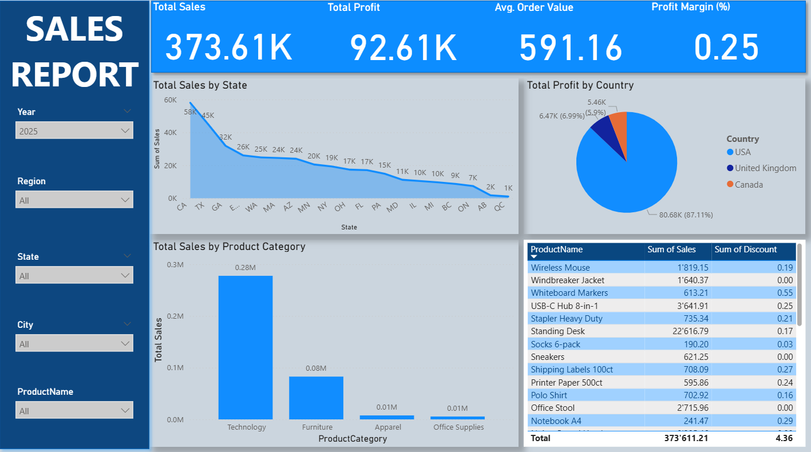

# Sales Performance Analysis  
**Author:** Musa Usman  
**Affiliation:** Department of Business Mathematics and Data Science, University of Hohenheim  

---

## Summary

This project delivers an interactive Power BI dashboard for analysing retail sales and profitability.  
It includes custom DAX measures (Total Profit, Total Sales, Profit Margin, Average Order Value, Order Count), dynamic slicers, and clear visual insights across products, locations, and time periods.  
The project demonstrates practical skills in business reporting, KPI creation, dashboard design, and data-driven decision support — core capabilities required for data analyst and BI roles.

---

## Data Summary

The dataset contains structured retail transactions with the following fields:

### **Time Attributes**
- Year  
- Date  

### **Geographic Attributes**
- Region  
- State  
- City  

### **Product Attributes**
- Product Category  
- Product Name  
- Discount  

### **Numerical Metrics**
- Sales Amount  
- Profit  
- Order Value  
- Quantity  
- Discount Amount  

These fields support multi-dimensional analysis and interactive filtering.

---

## DAX Measures (KPIs)

    Total Profit = SUM(Sales[Profit])
    Profit Margin (%) = DIVIDE([Total Profit], [Total Sales], 0)
    Average Order Value = DIVIDE([Total Sales], [Order Count], 0)
    Order Count = DISTINCTCOUNT(Sales[OrderID])

These measures drive KPI cards and dynamically update with slicers.

---

## Dashboard Preview

The dashboard presents KPIs, sales trends, geographic breakdowns, and product-level insights.  
To explore interactive filtering, hover insights, and dynamic visuals, download the PBIX file below.

---

## Interactive Dashboard

 **[Sales_Dashboard.pbix](Sales_Dashboard.pbix)**

Opening in Power BI Desktop (free) enables:

- Year / Region / State / City / Product slicers  
- KPI cards (Sales, Profit, Margin, AOV, Order Count)  
- Bar, line, and pie charts  
- Product table with discounts  
- Full data model and DAX view  

---

## Key Insights

- Clear variation in sales and profit across states and regions  
- Top-performing product categories identified  
- Profit margin and average order value calculated via DAX  
- Discount levels visualised to understand sales–discount relationships  
- Slicers allow customised business exploration for decision-making   
---

## Tools Used

- Power BI Desktop  
- Excel  
- DAX  
- Power Query  

---

## How to Use

1️⃣ Clone the repo:  
    git clone https://github.com/usmanmus/Sales_Dashboard.git  

2️⃣ Open the PBIX file in Power BI Desktop  

3️⃣ Explore the dashboard using slicers and visuals  

